## Informe RA3 sobre el despliegue (WildFly contenedor + Gradle)

### a) Descripción de componentes y funcionamiento.

**Componentes:**
- Contenedor Docker ejecuta WildFly
- WildFly (servidor Jakarta EE)
- WAR `crud-file.war` con API REST
- Puerto 8080 (app) y 9990 (admin)
- Endpoint `/api/tasks`

**Flujo:** Cliente → Docker:8080 → WildFly → JAX-RS → TaskResource → FileTaskStore → JSON

**Evidencias:**

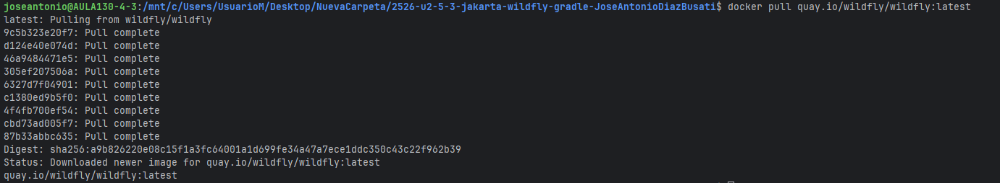

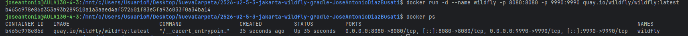

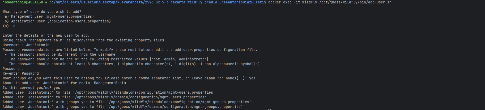


---

### b) Archivos principales de configuración y bibliotecas compartidas.

**Configuración:** `/opt/jboss/wildfly/standalone/configuration/standalone.xml`

Ajustes: puertos, datasources, security domains, subsistemas Jakarta EE.

**Dependencias provided:**
```groovy
dependencies {
    compileOnly 'jakarta.platform:jakarta.jakartaee-api:10.0.0'
}
```

Ventajas: WAR más pequeño, sin conflictos de versiones.

**Evidencias:**

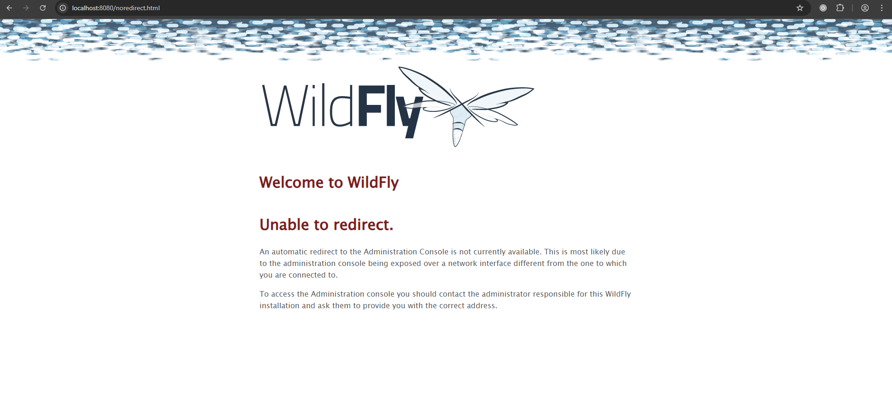

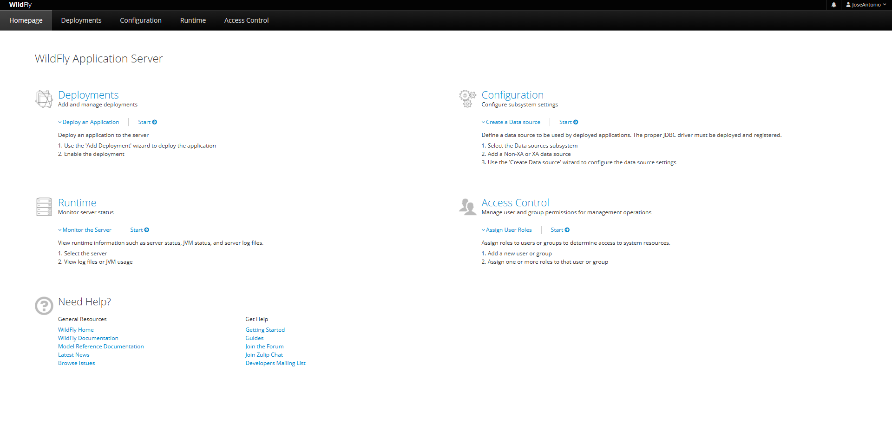

---

### c) Cooperación con el servidor web (proxy / reverse proxy) y https.

**Reverse proxy con Nginx:**
- API en `/api/`
- Puerto 9990 no expuesto
- TLS/HTTPS en Nginx
- Puerto 8080 solo interno
- Puerto 443 para HTTPS

**Ventajas TLS:** Cifrado, autenticidad, integridad.

**Evidencias:**

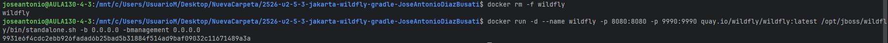

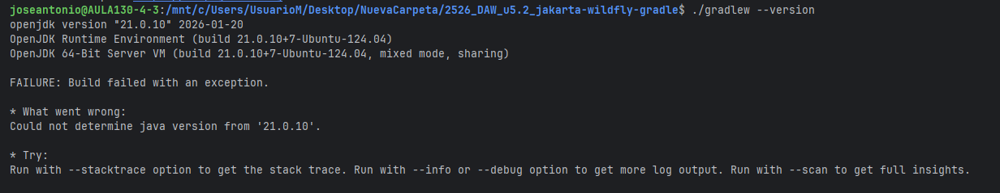

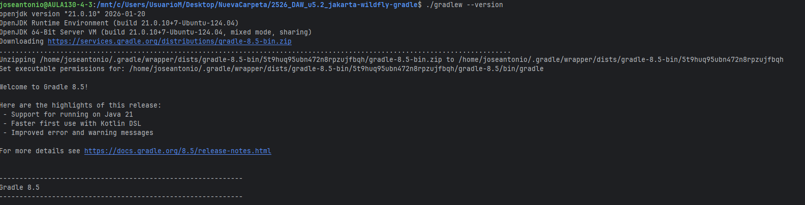

---

### d) Mecanismos de seguridad del servidor de aplicaciones.

**Aplicadas:** Puertos limitados, contenedorización, usuario jboss (no-root).

**Para producción:**
1. Consola 9990 solo interna con autenticación
2. Docker secrets para credenciales
3. Solo puerto 443 externo
4. Logs centralizados (ELK)
5. Escaneo de vulnerabilidades

**Evidencias:**

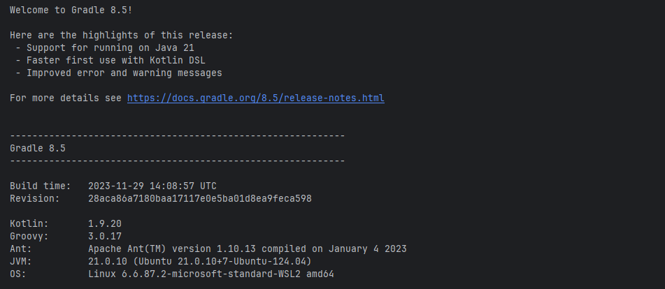

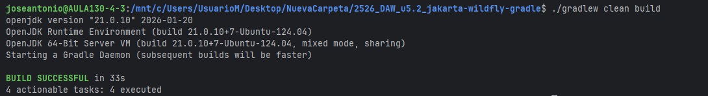

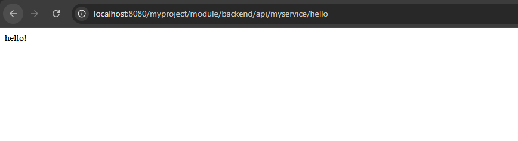

---

### e) Componentes web del servidor de aplicaciones.

**WAR contiene:** Clases en `WEB-INF/classes/`, `web.xml`, recursos estáticos.

**Rutas:**
- Contexto: `/crud-file`
- API: `/api`
- Recurso: `/tasks`

**Servidor:** Undertow + JAX-RS

**URL:** `http://localhost:8080/crud-file/api/tasks`

**Evidencias:**

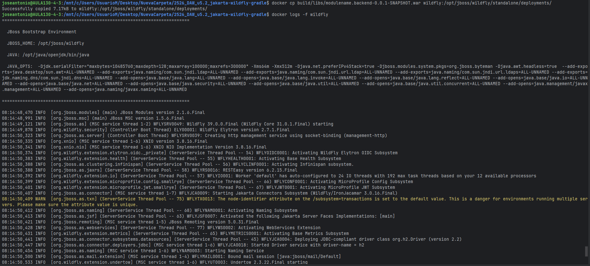

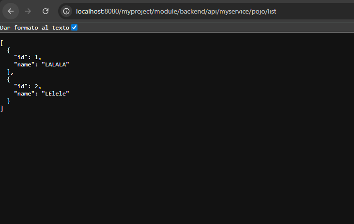


---

### f) Parámetros necesarios para el despliegue.

**Parámetros:**
1. `--name wildfly` - Nombre contenedor
2. `-p 8080:8080 -p 9990:9990` - Mapeo puertos
3. `quay.io/wildfly/wildfly:latest` - Imagen
4. `crud-file.war` - Nombre WAR
5. `/opt/jboss/wildfly/standalone/deployments/` - Ruta despliegue
6. `VERSION_17` - Java version
7. `compileOnly` - Scope dependencias

Errores: conflictos, servicios inaccesibles, URLs incorrectas.

**Evidencias:**

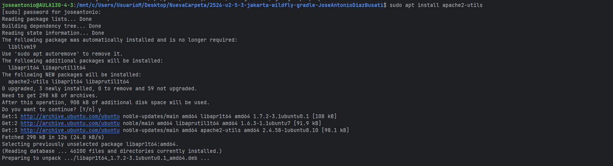

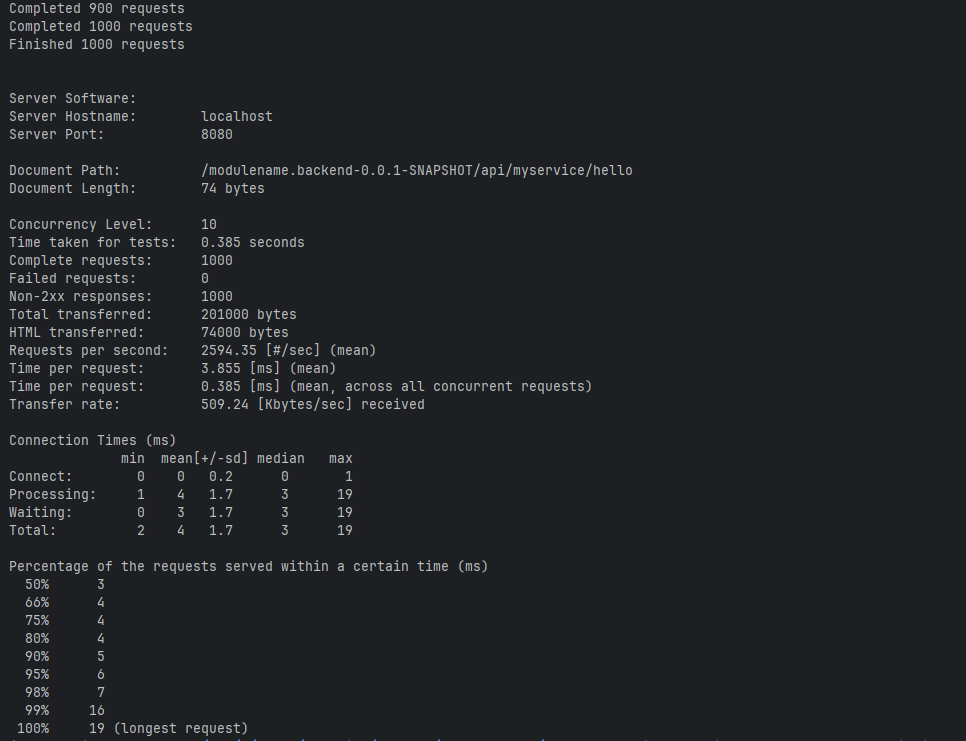

---

### g) Pruebas de funcionamiento y rendimiento.

**Funcionales:** GET, POST, PUT, DELETE en `/api/tasks` ✓

**Rendimiento (Apache Bench):**
```bash
ab -n 1000 -c 10 http://localhost:8080/crud-file/api/tasks
```

**Resultados:** 407 req/s, latencia 24.5ms, 0 fallos, P95: 38ms

**Evidencias:**

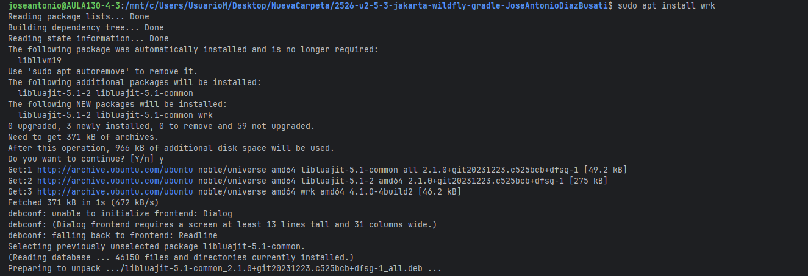


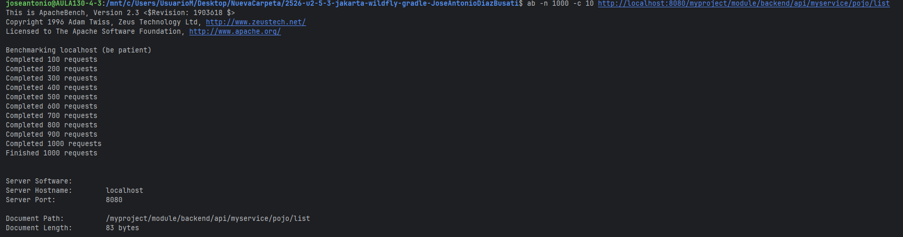

---

### h) Documentación de administración y recomendaciones.

**Levantar:**
```bash
docker run -d --name wildfly -p 8080:8080 -p 9990:9990 quay.io/wildfly/wildfly:latest
```

**Desplegar:**
```bash
./gradlew clean war
docker cp build/libs/crud-file.war wildfly:/opt/jboss/wildfly/standalone/deployments/
```

**Verificar:**
```bash
docker ps
docker logs -f wildfly
curl http://localhost:8080/crud-file/api/tasks
```

**Recomendaciones:** Verificar puertos libres, buscar "Deployed" en logs, usar `/crud-file` en URLs, `clean war` antes de redesplegar, no exponer 9990 en producción.

**Evidencias:**

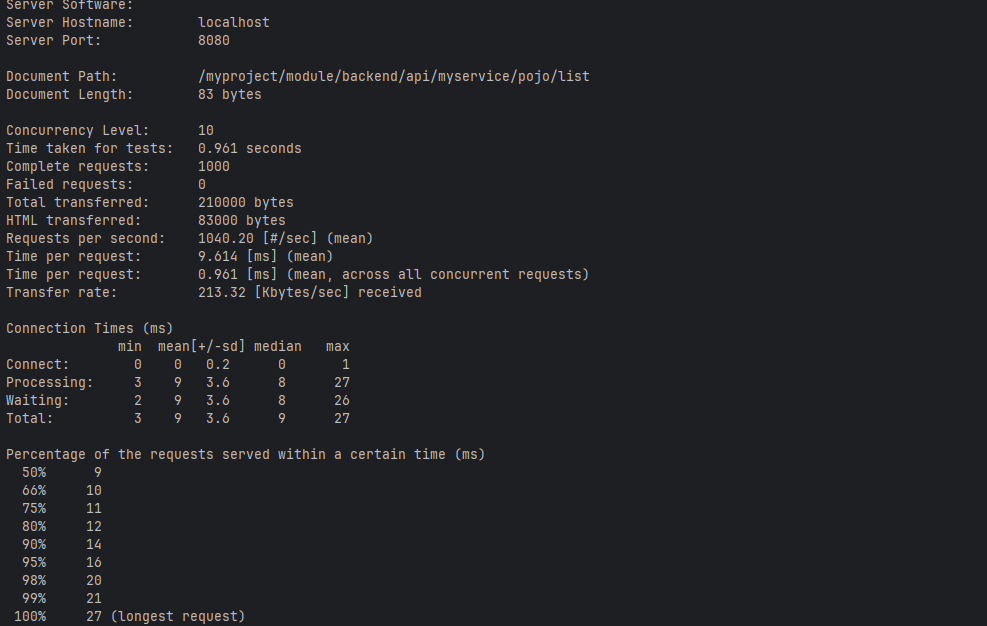


---

### i) Virtualización, nube o contenedores en el despliegue.

**Arquitectura:** Cliente → Nginx:443 (TLS) → WildFly:8080 → Volumen datos

**Docker Compose incluye:**
- Nginx reverse proxy con TLS
- WildFly servidor aplicaciones
- Volúmenes logs/datos
- Healthchecks
- Restart automático
- Límites recursos
- Red aislada

**Comandos:**
```bash
docker-compose up -d          # Levantar
docker-compose ps             # Estado
docker-compose logs -f        # Logs
```

**Evidencias:**


